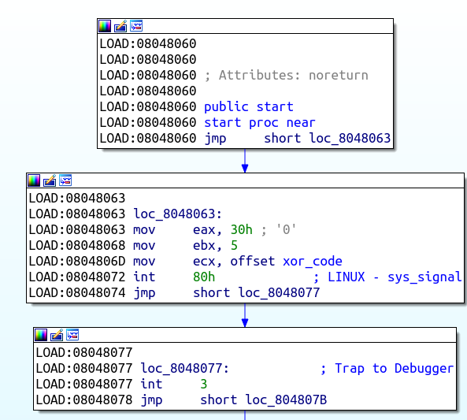
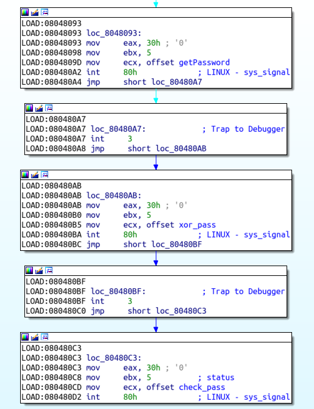

# cracking writeup
## 0protection

[ELF x86 - 0protection](https://www.root-me.org/en/Challenges/Cracking/ELF-x86-Basic)

程序很简单, 调用getString获取输入，之后调用strcmp比较输入和"123456789"是否相同，使用strings直接可以看到这个字符串。

## basic
[ELF x86 - Basic](http://challenge01.root-me.org/cracking/ch2/ch2.zip)

- 程序流程先读入一个字符串作为username，然后将该username和字符串"john"比较，
- 之后读入一个字符串password，将password字符串与字符串"the ripper"比较，相同的话输出密码。

## no software breakpoints

[ELF x86 - No software breakpoints](http://challenge01.root-me.org/cracking/ch20/ch20.bin)

程序功能很简单，输入密码，密码正确即可，
- 程序只有两个函数，分别为start函数和sub\_8048115函数
- 程序首先调用函数sub\_8048115, 传入参数为代码段中存在代码的开始地址和结束地址，之后为一个字节一个字节读入整个程序的代码段中包含的代码的部分，将指令内容加到ecx上，并不断将ecx左移三位，得到最终的ecx值。
- 之后利用ecx值和输入的密码计算得到一个新的字符串与程序中的字符串相比，符合则输入密码正确。
- 使用调试器的软件断点的时候，会修改代码段为0xcc，此时计算的ecx不是原本的程序无调试运行计算的结果。使用该值无法反推出正确的输入密码。
- 为了避免使用软件断点，先在计算hash值之前插入软件断点，运行之后删除软件断点，插入硬件断点，计算得到正确的ecx值即可，利用该ecx值与程序中的字符串反推出输入字符串。
- 通过ecx值反推密码的程序为exp.c。

## anti-debug

[ELF x86 - Anti-debug]

进入程序，程序使用注册断点信号处理函数的方式执行真正的代码功能, 这样就阻止了调试器插入断点。同时，代码中存在数据，用来混淆代码，使用objdump和ida pro看到的反汇编不一样：

```
 8048060:       eb 01                   jmp    0x8048063
 8048062:       e8 b8 30 00 00          call   0x804b11f
 8048067:       00 bb 05 00 00 00       add    %bh,0x5(%ebx)
 804806d:       b9 e2 80 04 08          mov    $0x80480e2,%ecx
 8048072:       cd 80                   int    $0x80
 8048074:       eb 01                   jmp    0x8048077
 8048076:       ce                      into
 8048077:       cc                      int3
```
在0x8048060处跳转到指令中间，从0x8048062出开始的反汇编指令起到了混淆的作用，直接使用ida pro打开即可。



在0x0804806D处传递了信号处理函数的地址，这里对函数分析之后进行了重命名

进入这段函数之后，简单分析可得，这段函数作用是读取从0x08048104到0x80482E8的数据（这段数据是代码段的代码），将每四个字节代码与0x8048FC1做xor运算
可以看出，程序将原本的部分代码进行了加密处理，阻止了静态分析出程序原本的功能。

这里不能使用调试器直接下断点得到解密的可执行程序，于是利用python lief处理可执行程序，得到解密之后的可执行程序，python解密程序为antiDebug/exp.py

在程序解密之后，在0x08048085出程序调用check\_modified，该函数的作用是计算整个代码段的xor结果，与源文件的xor结果（保存在原程序中）比较，如果不同，退出，该步骤主要是防止篡改程序

由于程序功能是利用trap断点的方式执行，调试的话会引起功能的执行，所以静态分析程序功能，看能不能得到密码

之后的流程是读取用户密码，然后使用0xfc xor 密码，之后检查加密的密码和保存的字符串是否相同



为了得到解密的密码，直接将0xfc与保存的字符串xor得到密码，实现的代码为antiDebug/exp.c
